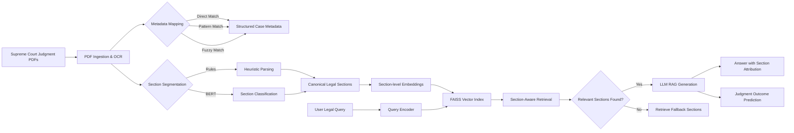

# Legal Document Assistant using SA-RAG (Section-Aware RAG)

## 📚 Project Overview
Legal Document Assistant is an AI-powered system designed to analyze, retrieve, and answer questions from Indian Supreme Court judgments using a Section-Aware Retrieval-Augmented Generation (SA-RAG) architecture.

Unlike traditional RAG systems that rely on fixed-size text chunking, this project preserves the canonical structure of legal judgments, significantly improving retrieval relevance, interpretability, and reducing hallucinations.

---

## 🚀 Key Features
- Section-Aware Segmentation:
  - Facts
  - Issues
  - Arguments
  - Precedents
  - Analysis
  - Conclusion
- Multi-tier PDF-to-Metadata Mapping (100% document coverage)
- Hybrid Retrieval Strategy (Dense + BM25 + Section Boosting)
- Low-hallucination Legal Question Answering
- Judgment Outcome Prediction
- Explainable and Traceable Responses

---

## 🧠 Architecture Overview

---

## 📊 Dataset
- 930 Indian Supreme Court Judgments
- Annotated canonical legal sections
- Structured metadata (case ID, year, bench, citations)
- Train / Validation / Test split

---

## 🏗️ Tech Stack
- Python 3.9
- PyTorch
- Hugging Face Transformers
- Sentence-Transformers
- FAISS
- SpaCy, NLTK
- LLaMA / Mistral (RAG-based)

---

## 📈 Performance
| Metric | Score |
|------|------|
| Top-3 Recall | 88% |
| Section Accuracy | 85% |
| Fully Correct Answers | 60% |
| Hallucination Rate | 13% |
| PDF Coverage | 100% |
| Outcome Prediction | 82% |

---

## ▶️ How to Run
```bash
pip install -r requirements.txt
jupyter notebook legal_document_assist.ipynb
```

---

## 👥 Team
- Deekshant Gupta (22BAI1306)
- Patel Swapnilkumar Chandubhai (22BAI1308)
- Yuvraj Singh (22BAI1324)


---

## 📜 License
Academic & Research Use Only
